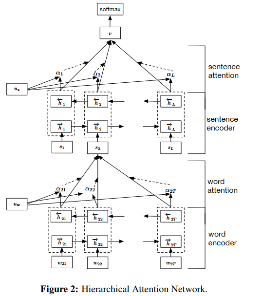
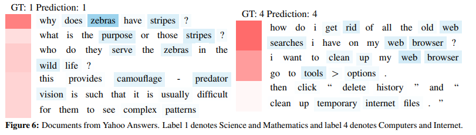

# Hierarchical Attention Networks for Document Classification  

## 摘要

**本文针对文本分类任务提出了一个层次化 `attention` 机制模型 `HAN`**，有两个显著的特点：(1)采用“词-句子-文章”的层次化结构来表示一篇文本。（2）该模型有两个层次的 `attention` 机制，分别存在于词层次 `word level` 和句子层次 `sentence level`。从而使该模型具有对文本中重要性不同的句子和词的能力给予不同“注意力”的能力。作者在6个数据集合上进行了测试，并且相较以往的模型效果提升显著。最后，通过可视化说明该模型可以选择出含有丰富信息的词语和句子。

## 1 介绍

文本分类是一项基础的 `NLP` 任务，在主题分类，情感分析，垃圾邮件检测等应用上有广泛地应用。其目标是給每篇文本分配一个类别标签。本文中模型的直觉是，不同的词和句子对文本信息的表达有不同的影响，词和句子的重要性是严重依赖于上下文的，即使是相同的词和句子，在不同的上下文中重要性也不一样。就像人在阅读一篇文本时，对文本不同的内容是有着不同的注意度的。而本文在 `attention` 机制的基础上，联想到文本是一个层次化的结构，提出用词向量来表示句子向量，再由句子向量表示文档向量，并且在词层次和句子层次分别引入 `attention` 操作的模型。

## 2 层次注意力网络  

HAN的模型结构如**图2**所示，它包含一个词序列编码器，一个词层面的 `attention` 层，一个句子序列编码器，一个句子层级的 `attention` 层。

### 2.1 基于GRU的词序列编码器

`GRU` 是 `RNN` 的一个变种，使用门机制来记录序列当前的状态。隐藏层有两个门 `gate`，重置门 `reset gate`  $r_t$ 和更新门 `update gate`  $z_t$。这两个门一起来控制当前状态有多少信息要更新。在时刻 $t$，隐藏层状态的计算公式：
$$
h_t = (1-z_t) \odot h_{t-1} + z_t \odot \tilde{h}_t
$$
更新门 `update gate`  $z_t$ 是用来决定有多少过去的信息被保留，以及有多少新信息被加进来：
$$
z_t = \sigma(W_z x_t + U_z h_{t-1} + b_z)
$$
这里 $x_t$ 是在时刻 $t$ 输入的单词的词向量，候选状态 $\tilde{h}_t$ 算方法和普通的 `RNN` 相似：
$$
\tilde{h}_t = \tanh(W_h x_t + r_t \odot(U_h h_{t-1})+b_h)
$$
重置门 $r_t$ 决定有多少过去的信息作用于候选状态，如果 $r_t$ 是0，即忘记之前的所有状态：
$$
r_t = \sigma(W_r x_t + U_r h_{t-1}+b_r)
$$

### 2.2 层次化attention

#### 2.2.1 词编码器（Word Encoder）

由词序列 $w_{it},t \in [0,T]$ 组成的句子，首先根据 $x_{it}=W_e w_{it}$ 把词转化成词向量，然后用双向的 `GRU` 网络，可以将正向和反向的上下文信息结合起来，获得隐藏层输出。
$$
x_{it}=W_e w_{it},t \in [1,T]
$$

$$
\overrightarrow{h_{it}}=\overrightarrow{GRU}(x_{it}),t \in [1,T]
$$

$$
\overleftarrow{h_{it}}=\overleftarrow{GRU}(x_{it}),t \in [T,1]
$$

对于一个给定的词语 $w_{it}$，经过 `GRU` 网络后，我们获得了一种新的表示： $h_{it}=[\overrightarrow{h_{it}},\overleftarrow{h_{it}}]$

$h_{it}$ 包含了 $w_{it}$ 周围两个方向的信息。

 #### 2.2.2 词级别的attention机制

`attention` 机制的目的是要把一个句子中对句子的含义最重要贡献最大的词语找出来。我们通过将 $h_{it}$ 输入到一个单层的感知机 `MLP` 中得到的结果 $u_{it}$ 作为 $h_{it}$ 的隐含表示。
$$
u_{it}=\tanh(W_w h_{it}+b_w)
$$
为了衡量单词的重要性，我们用 $u_{it}$ 和一个随机初始化的上下文向量 $u_w$ 的相似度来表示，然后经过 `softmax` 操作获得了一个归一化的 `attention` 权重矩阵 $\alpha_{it}$，代表句子 $i$ 中第 $t$ 个词的权重。
$$
\alpha_{it}=\frac{exp(u_{it}^T u_w)}{\sum_t exp(u_{it}^T u_w)}
$$
有了 `attention` 权重矩阵以后，我们可以将句子向量 $s_i$ 看作组成这些句子的词向量的加权求和。这里的上下文向量  $u_w$ 是在训练网络的过程中学习获得的。我们可以把  $u_w$ 当作一种询问的高级表示，比如“哪些词含有比较重要的信息？”
$$
s_i=\sum_t \alpha_{it}h_{it}
$$

#### 2.2.3 语句编码器(Sentence Encoder)

得到了句子向量表示 $s_i$ 以后，我们用类似的办法获得文档向量：
$$
\overrightarrow{h_{i}}=\overrightarrow{GRU}(s_{i}),i\in [1,L]
$$

$$
\overleftarrow{h_{i}}=\overleftarrow{GRU}(s_{i}),i \in [L,1]
$$

对于给定的句子 $s_i$ 我们得到了相应的句子表示 $h_{i}=[\overrightarrow{h_{i}},\overleftarrow{h_{i}}]$。这样获得的表示可以包含两个方向的上下文信息。 

#### 2.2.4 句子级别的attention

和词级别的 `attention` 类似，我们也提出了一个句子级别的上下文向量 $u_s$，来衡量一个句子在整篇文本的重要性。
$$
u_i = \tanh(W_s h_i+b_s)
$$

$$
\alpha_i =\frac{exp(u_{i}^T u_s)}{\sum_i exp(u_{i}^T u_s)}
$$

$$
v=\sum_i \alpha_{i}h_{i}
$$

#### 2.2.5 文本分类

我们获得了整篇文章的向量表示 $v$，最后可以使用全连接的 `softmax` 层进行分类。
$$
p = softmax(W_c v+b_c)
$$
 我们使用正确标签的负对数似然作为训练损失：
$$
L = -\sum_d \log p_{dj}
$$
 其中 $j$ 是文档 $d$ 的标签 。

## 3 实验

### 3.1 数据集

论文中使用了六个数据集，Yelp reviews2013，2014，,2015；IMDB reviews；Yahoo Answers；Amazon reviews。每个数据集中80%的数据用作训练集，10%的数据用作验证集，剩余10%的集合用作测试集。

### 3.2 实验指标与对比模型

- **线性模型：**使用手工构建的统计数据作为特征，多项式logistic回归作为分类器
- **SVM：**支持向量机+unigr，bigrams
- **word-based CNN：**基于词的卷积神经网络
- **Character-based CNN：**字符级别的卷积神经网络
- **Conv/LSTM-GRNN：**使用“词-句子-文本”的层次化结构表示文档，然后用带有门限制的 `RNN` 做分类。

### 3.3 实验结果

### 3.4 结果分析

根据上表的实验结果可以看出来，`HAN` 在所有的六个数据集合上均取得了最好的效果。这种效果的提升是不受数据集大小限制的。在相对较小的数据集比如 Yelp2013 和 IMDB 上，我们的 `HAN` 模型超过基准模型的最好表现的比率分别为3.1%和4.1%。同样地在大型数据集 Yelp2014，Yelp2015，Yahoo Answer,Amazon Answer上，我们的模型优于之前的最好模型的比例分别为3.2%，3.4%，4.6%，6.0%。

一些没有使用层次结构来表示文本的神经网络分类算法比如CNN-word，CNN-char，LSTM在一些大数据集上并没有超过基准模型太多。单从文本的结构化表示来看，HN-MAX，HN-AVG 都可以显著提升CNN-word，LSTM等模型的性能。我们将层次话结构和 `Attention` 机制联合起来的模型，更是超过了单纯的层次化模型 LSTM-GRNN。

 ### 3.5 可视化分析

上图是词 “good” 在 `IMDB` 数据集中的 `attention` 权重分布。 (b)-(f) 按等级1-5分进行分层，我们可以看到，随着评级的升高，“good” 的权重分布向高端转移 。 

上图是 “bad” 在 `IMDB` 数据集中的 `attention` 权重分布。 (b)-(f) 按等级1-5分进行分层，我们可以看到，词 “bad” 在评价等级较低的评论里权重较大，在评价高的评论里权重小。 

每一行左侧的红色色块表示句子的 `attention` 权重，颜色越深说明句子的权重越大，蓝色的是词在每句句子中的权重。  需要注意的是，为了让不重要句子中相对重要的词也能显示出来，此处词的颜色深度=sqrt(句子权重)*词权重。 

在情感分析任务中，从上图我们可以看到，在好评里，delicious，fun，amazing，recommend 等词所在的句子颜色深，权重大。在差评里，terrible，not等词权重大。 

在主题分类任务中，在科学自然类别里，zebra，strips，camouflage，predator 权重比较大。 在计算机网络类别里 web，searches，browsers 的权重较大。

## 4 总结

本文提出了一种基于层次化 `attention` 的文本分类模型，可以利用 `attention` 机制识别出一句话中比较重要的词语，利用重要的词语形成句子的表示，同样识别出重要的句子，利用重要句子表示来形成整篇文本的表示。实验证明，该模型确实比基准模型获得了更好的效果，可视化分析也表明，该模型能很好地识别出重要的句子和词语。