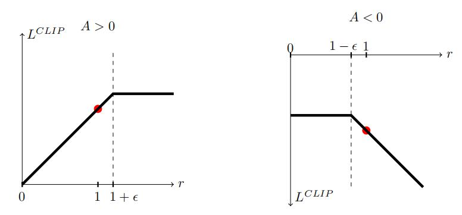

首先我们回顾一下“策略梯度方法（PG）”和“信赖域策略优化（TRPO）”。
**1.策略梯度方法（PG）**
策略梯度方法通过计算策略梯度的估计并利用随机梯度上升算法来工作。 最常用的梯度估计形式为：
$$
\hat{\mathbb{E}}_t\left[\nabla_\theta\log \pi_\theta(a_{t}|s_{t})\hat{A}_t\right]\tag{1}
$$

其中$\pi_\theta$为随机策略，$\hat{A}_t$是优势函数在时间步$t$的估计，在使用自动微分器时，我们的损失函数为：
$$
L^{PG}(\theta)=\hat{\mathbb{E}}_t\left[\log \pi_\theta(a_{t}|s_{t})\hat{A}_t\right]\tag{2}
$$

**2.信赖域策略优化（TRPO）**

$TRPO$要优化的目标函数如下：
$$
maximize_{\theta}\hat{\mathbb{E}}_t\left[\frac{\pi_{\theta}\left(a_t|s_t\right)}{\pi_{\theta_{old}}\left(a_t|s_t\right)}\hat{A}_t\right]\tag{3}
$$

$$
\\ subject\ to\ \hat{\mathbb{E}}_t\left[KL\left[\pi_{\theta_{old}}\left(\cdot |s_t\right)||\pi_{\theta}\left(\cdot |s_t\right)\right]\right]\le\delta
$$

**3.近端策略优化算法(PPO)**

**PPO1：截断替代目标**

首先，我们令$r_t(\theta)=\frac{\pi_{\theta}\left(a_t|s_t\right)}{\pi_{\theta_{old}}\left(a_t|s_t\right)}$，所以$r(\theta_{old})=1$。$TRPO$的替代目标为
$$
L^{CPL}(\theta)=\hat{\mathbb{E}}_t\left[\frac{\pi_{\theta}\left(a_t|s_t\right)}{\pi_{\theta_{old}}\left(a_t|s_t\right)}\hat{A}_t\right]=\hat{\mathbb{E}}_t\left[r_t(\theta)\hat{A}_t\right]\tag{4}
$$

上标$CPI$指的是$TRPO$中的保守政策迭代，如果没有约束，最大化$L^{CPL}$将会导致非常大幅度的梯度更新。为了惩罚策略的变化（即$r_t(\theta)$远离1，即新旧策略的KL 散度不能太大），提出了如下的目标
$$
L^{CLIP}(\theta)=\hat{\mathbb{E}}_t\left[ min(r_t(\theta)\hat{A}_t ,clip(r_t(\theta),1-\varepsilon,1+\varepsilon)\hat{A}_t)\right]\tag{5}
$$

论文中$\epsilon=0.2$，直观示意图如下

该算法的意思为：
当A>0时，如果$r_t(\theta)>1+\epsilon$，则$L^{CLIP}(\theta)=(1+\epsilon)\hat{A}_t$；如果$r_t(\theta)<1+\epsilon$，则$L^{CLIP}(\theta)=r_t(\theta)\hat{A}_t$;

当A<0时，如果$r_t(\theta)>1-\epsilon$，则$L^{CLIP}(\theta)=r_t(\theta)\hat{A}_t$；如果$r_t(\theta)<1-\epsilon$，则$L^{CLIP}(\theta)=(1-\epsilon)\hat{A}_t$;

**PPO2：自适应KL惩罚系数**

在$TRPO$中，使用“自适应惩罚系数 ”$\beta$ 来约束KL散度，在此算法的最简单实例中，我们在每个策略更新中执行以下步骤：

* 使用多个的minibatch SGD，优化KL惩罚的目标

$$
L^{KLPEN}(\theta)=\hat{\mathbb{E}}_t\left[\frac{\pi_{\theta}\left(a_t|s_t\right)}{\pi_{\theta_{old}}\left(a_t|s_t\right)}\hat{A}_t-\beta \ KL\left[\pi_{\theta_{old}}\left(\cdot |s_t\right),\pi_{\theta}\left(\cdot |s_t\right)\right]\right]\tag{6}
$$

* 计算$d=\hat{\mathbb{E}}_t\left[KL\left[\pi_{\theta_{old}}\left(\cdot |s_t\right),\pi_{\theta}\left(\cdot |s_t\right)\right]\right]$

$\ \ \ \ \ \ 如果d<d_{targ}/1.5,\beta\leftarrow \beta/2$

$\ \ \ \ \ \ 如果d>d_{targ}\times1.5,\beta\leftarrow \beta\times2$

实验中，PPO2的效果没有PPO1的效果好

**4.算法**
$$
L^{CLIP+VF+S}_t(\theta) = \hat{E}_t\left[L^{CLIP}_t(\theta)−c_1L^{VF}_t(\theta)+c_2S[\pi_\theta](s_t)\right]
$$

$$
其中 c1, c2 是系数,S 表示熵奖励, L^{VF}_t是平方误差损失
(V_\theta(s_t)-V^{targ}_t)^2
$$

优势估计函数为
$$
\hat{A}_{t}=-V\left(s_t\right)+r_t+\gamma r_{t+1}+...+\gamma^{T-t+1}r_{T-1}+\gamma^{T-t}V\left(s_{T}\right)\tag{7}
$$

另外，我们可以使用广义优势函数来扩广$\hat{A}_{t}$，当λ= 1时，它会趋近到等式（7）
$$
\hat{A}_{t}=\delta_t+(\gamma\lambda) \delta_{t+1}+...+...+(\gamma\lambda)^{T-t+1}\delta_{T-1}\tag{8}
\\where\  \delta_t=r_t+\gamma V(s_{t+1})-V(s_{t})
$$

使用固定长度轨迹段的近端策略优化（PPO）算法如下所示。 每次迭代时，N个actor中的每个都收集T个时间步长的数据。 然后我们在这些NT时间步长的数据上构建替代损失，并使用 minibatch SGD（或通常为了更好的性能，Adam ）进行K个epochs的优化。

